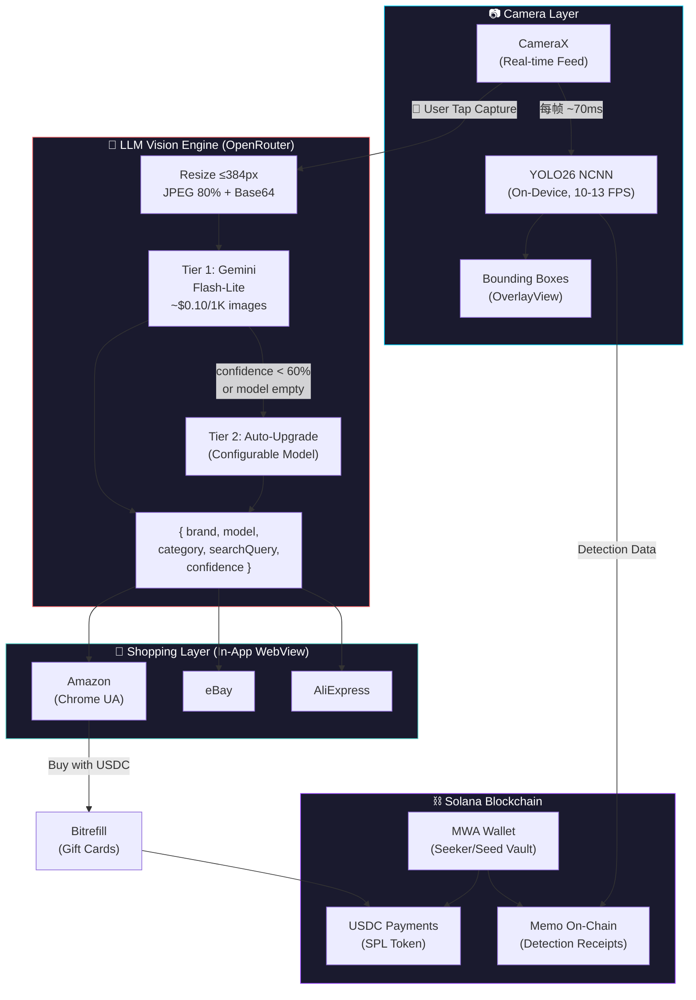

# 📸 SnapShop — See It. Identify It. Buy It with USDC.

> **Point your camera at any product → AI identifies it instantly → Shop across Amazon, eBay & AliExpress → Pay with USDC on Solana**

[](https://solanamobile.com)
[](https://developer.android.com)
[](https://ai.google.dev)
[](https://www.circle.com/usdc)

---

## 🎯 The Problem

**Shopping in the real world is disconnected from the crypto world.**

You see a product you like — a pair of sneakers someone is wearing, a gadget on a desk, a piece of furniture in a cafe. Today, you have to:
1. Figure out what it is (Google it? Ask someone?)
2. Search for it manually on shopping sites
3. Pay with fiat (credit cards, bank transfers)

There's no bridge between **"I see it with my eyes"** and **"I buy it with my crypto wallet."**

## 💡 The Solution

**SnapShop** turns your Solana Mobile phone into an AI-powered shopping assistant:

```
📷 Point Camera → 🤖 AI Identifies Product → 🛒 Shop Instantly → 💰 Pay with USDC
     (Real-time)     (Brand + Model + Color)   (Amazon/eBay/Ali)    (Solana Blockchain)
```

One seamless flow. No typing. No searching. See it, snap it, buy it — all on-chain.

---

## ✨ Key Features

### 🔍 Dual AI Vision Engine
- **On-Device YOLO26**: Real-time object detection at 10-13 FPS using NCNN — bounding boxes appear instantly, no network required
- **Cloud LLM Identification**: Tiered cascade strategy using Gemini via OpenRouter — identifies specific brands, models, and variants (e.g., "Apple iPhone 16 Pro Max Natural Titanium", not just "phone")

### 🧠 Smart Tiered Cascade
| Tier | Model | Cost | When Used |
|------|-------|------|-----------|
| **Tier 1** | Gemini 2.5 Flash-Lite | ~$0.10/1K images | Default — fast, cheap |
| **Tier 2** | Configurable (Gemini 3 Flash) | ~$0.50/1K images | Auto-upgrades when confidence < 60% |

> **65x cheaper** than Google Cloud Vision API ($6.50/1K) while delivering **brand + model level** identification

### 🛒 Multi-Platform Shopping
- **Amazon** — Smart routing: tries native app first, falls back to in-app WebView
- **eBay** — Full in-app browsing experience
- **AliExpress** — Global product access
- All shopping happens **inside the app** — no context switching

### 💰 USDC Payments via Solana
- **Wallet Connection**: Mobile Wallet Adapter (MWA) integration with Seeker/Seed Vault
- **USDC Balance**: Real-time SPL token balance display
- **Buy with USDC**: Bitrefill integration for Amazon gift cards → pay with USDC on Solana
- **On-Chain Receipts**: Detection data recorded as Solana Memo transactions — immutable shopping history

### 🔒 Privacy-First Architecture
- **Images never leave your device** for YOLO detection
- Cloud LLM receives only compressed thumbnails (≤384px) — no full-resolution photos
- On-chain memos contain only detection metadata, never images
- No user accounts, no tracking, no data collection

---

## 🏗️ Architecture



---

## 🚀 User Flow

### Flow 1: SnapShop (AI Shopping)
1. **Open Camera** → YOLO26 draws real-time bounding boxes around objects
2. **Tap Capture** → Frame is sent to LLM Vision Engine
3. **AI Identifies** → "Apple iPhone 16 Pro Max" with 92% confidence
4. **Choose Platform** → Amazon / eBay / AliExpress
5. **Shop In-App** → Full WebView browser, no app switching
6. **Pay with USDC** → Bitrefill gift card purchase via Solana wallet

### Flow 2: Detect & On-Chain
1. **Real-time Detection** → YOLO26 identifies objects at 10-13 FPS
2. **Tap "On-Chain"** → Detection results serialized to compact JSON
3. **Sign with MWA** → Seeker wallet signs the Memo transaction
4. **Recorded Forever** → Immutable detection record on Solana blockchain
5. **View on Explorer** → Direct link to Solana Explorer

---

## 📱 Screenshots

> *Coming soon — see [Demo Video](#demo) for the full experience*

---

## 🛠️ Tech Stack

| Layer | Technology | Purpose |
|-------|-----------|---------|
| **Object Detection** | YOLO26n + NCNN | Real-time on-device detection (CPU/GPU) |
| **AI Identification** | Gemini Flash via OpenRouter | Brand + model level product ID |
| **Camera** | CameraX 1.3.1 | Modern Android camera API |
| **Blockchain** | Solana Web3 + MWA 2.0.3 | Wallet connection, transactions |
| **Payments** | USDC (SPL Token) | Stablecoin payments |
| **Shopping** | In-App WebView | Amazon, eBay, AliExpress |
| **Gift Cards** | Bitrefill | USDC → Amazon gift cards |
| **Native Code** | C++ / CMake / NDK | YOLO inference engine |
| **Languages** | Java + Kotlin | Android app code |
| **Image Processing** | OpenCV Mobile | Frame preprocessing |

---

## 📦 Getting Started

### Prerequisites
- Android Studio Hedgehog or newer
- Android SDK 24+ (target 34)
- NDK with CMake support
- A Solana wallet app (Seed Vault / Phantom) for blockchain features

### 1. Clone the Repository
```bash
git clone https://github.com/alertcat/SnapShop.git
cd SnapShop
```

### 2. Configure API Keys

Create or edit `local.properties` in the project root:

```properties
# LLM Vision (required for product identification)
OPENROUTER_API_KEY=your_openrouter_api_key
OPENROUTER_MODEL=google/gemini-3-flash-preview

# Google Vision API (optional legacy fallback)
GOOGLE_VISION_API_KEY=your_google_vision_key

# Shopping
AMAZON_AFFILIATE_TAG=your_tag

# Solana
MERCHANT_WALLET_ADDRESS=your_solana_address
```

> Get your OpenRouter API key at [openrouter.ai/keys](https://openrouter.ai/keys) — Gemini Flash-Lite costs ~$0.0001 per image

### 3. Download Native Dependencies

**NCNN** — Download from [ncnn releases](https://github.com/Tencent/ncnn/releases):
```
ncnn-YYYYMMDD-android-vulkan.zip → extract to app/src/main/jni/ncnn-android-vulkan/
```

**OpenCV Mobile** — Download from [opencv-mobile releases](https://github.com/nihui/opencv-mobile/releases):
```
opencv-mobile-4.10.0-android.zip → extract to app/src/main/jni/
```

### 4. Place YOLO Model Files
```
app/src/main/assets/
├── yolo26n.ncnn.param
└── yolo26n.ncnn.bin
```

Export from Ultralytics:
```python
from ultralytics import YOLO
model = YOLO("yolo26n.pt")
model.export(format="ncnn")
```

### 5. Build & Run
```bash
./gradlew assembleDebug
```

Install on your Solana Seeker or any Android device (API 24+).

---

## 🔗 Solana Integration Details

### Mobile Wallet Adapter (MWA)
```kotlin
// Connect to Seeker wallet
val walletAdapter = MobileWalletAdapter(
    connectionIdentity = ConnectionIdentity(
        identityUri = Uri.parse("https://snapshop.app"),
        identityName = "SnapShop"
    )
)
```

### On-Chain Memo Format
Detection results are recorded on Solana's Memo Program as compact JSON:
```json
{
  "t": "yolo26",
  "v": 1,
  "n": 3,
  "d": [
    {"c": "person", "p": 0.95, "b": [10, 20, 100, 200]},
    {"c": "laptop", "p": 0.88, "b": [150, 50, 300, 250]}
  ]
}
```

### USDC Payment Flow
```
User's Solana Wallet (USDC)
         │
         ▼
    Bitrefill.com (in-app WebView)
         │
         ▼
    Amazon Gift Card (instant delivery)
         │
         ▼
    Purchase product on Amazon
```

### Programs Used
| Program | Address |
|---------|---------|
| Memo Program | `MemoSq4gqABAXKb96qnH8TysNcWxMyWCqXgDLGmfcHr` |
| USDC Mint | `EPjFWdd5AufqSSqeM2qN1xzybapC8G4wEGGkZwyTDt1v` |
| Token Program | `TokenkegQfeZyiNwAJbNbGKPFXCWuBvf9Ss623VQ5DA` |
| ATA Program | `ATokenGPvbdGVxr1b2hvZbsiqW5xWH25efTNsLJA8knL` |

---

## 🤖 LLM Vision Engine Deep Dive

### Why LLM over Traditional Vision APIs?

| Approach | Identifies | Cost/1K | Example Output |
|----------|-----------|---------|----------------|
| Google Vision API | Generic labels | $6.50 | "Mobile Phone, Electronics" |
| Amazon Rekognition | Generic labels | $1.00 | "Phone, Gadget" |
| **SnapShop LLM Engine** | **Brand + Model** | **$0.10** | **"Apple iPhone 16 Pro Max"** |

Traditional vision APIs use fixed label taxonomies — they can't distinguish an iPhone from a Samsung. Multimodal LLMs have world knowledge and can identify specific products just like a human would. And when the exact model is unknown (due to knowledge cutoff), SnapShop's attribute-based approach still finds the right product.

### Knowledge Cutoff & Anti-Hallucination Design

LLMs have training data cutoff dates — they can't identify products released after training. For example, a model trained before iPhone 16 might misidentify it as iPhone 14.

**SnapShop solves this with attribute-based identification:**

```
Instead of guessing: "iPhone 14 Pro Max Gold"     ← WRONG model!
SnapShop describes:   "Apple iPhone Pro Max Desert Titanium triple camera"  ← Matches correctly!
```

The system prompt injects the **current system date** and instructs the LLM to:

| Strategy | How It Works |
|----------|-------------|
| **Describe, don't guess** | Focus on observable attributes (color, camera layout, material, form factor) |
| **Never hallucinate model numbers** | Leave `model` empty when uncertain — wrong model is worse than no model |
| **Attribute-based searchQuery** | Build search query from physical features, not guessed generations |
| **Confidence gating** | Only include model number in fallback search if confidence ≥ 85% |
| **Low temperature (0.1)** | Near-deterministic output, minimizes creative guessing |

This ensures shopping platforms match the **correct product** regardless of LLM knowledge cutoff.

### Token Optimization
- Images resized to ≤384px → only **258 tokens** in Gemini
- JPEG compression at 80% quality
- Max 500 output tokens (structured JSON response)
- **Total cost per identification: ~$0.0001**

---

## 📊 Performance

| Metric | Value |
|--------|-------|
| YOLO26 FPS (CPU) | 10-13 FPS |
| YOLO26 FPS (GPU/Vulkan) | ~4 FPS |
| LLM Identification Latency | < 2 seconds |
| LLM Cost per Image | ~$0.0001 (Tier 1) |
| Supported Architectures | arm64-v8a, armeabi-v7a |
| Min SDK | Android 7.0 (API 24) |
| Target SDK | Android 14 (API 34) |

### Tested Devices
| Device | CPU FPS | Notes |
|--------|---------|-------|
| Solana Seeker (Dimensity 7300) | ~13 FPS | Primary target device |
| Huawei P40 (Kirin 990) | ~10 FPS | CPU mode recommended |

---

## 🗂️ Project Structure

```
app/src/main/
├── java/com/example/snapshop/
│   ├── MainActivity.java          # Home screen + wallet connection
│   ├── DetectActivity.java        # YOLO detection + on-chain memo
│   ├── ShopCameraActivity.java    # AI shopping camera
│   ├── ProductResultsActivity.java # Shopping platform selection
│   ├── ShopWebViewActivity.java   # In-app shopping browser
│   ├── OverlayView.java          # Real-time bounding box renderer
│   ├── Yolo26Ncnn.java           # JNI bridge to NCNN engine
│   ├── LlmVisionHelper.kt       # Tiered LLM product identification
│   ├── VisionApiHelper.kt       # Google Vision API (legacy fallback)
│   ├── WalletHelper.kt          # Solana MWA + memo + USDC
│   ├── ShopHelper.kt            # Shopping URL builder
│   └── CustomTabHelper.kt       # Chrome Custom Tabs (fallback)
├── jni/
│   ├── yolo.cpp / yolo.h        # YOLO26 NCNN inference engine
│   ├── yolo26ncnn.cpp            # JNI bindings
│   └── CMakeLists.txt            # Native build config
├── assets/
│   ├── yolo26n.ncnn.param        # YOLO model architecture
│   └── yolo26n.ncnn.bin          # YOLO model weights
└── res/
    └── layout/                    # All activity layouts (dark theme)
```

---

## 🏆 Why SnapShop for Solana Mobile?

1. **Real-World Utility**: Bridges physical shopping with crypto payments — a use case billions of smartphone users can relate to
2. **Mobile-First**: Built from the ground up for Solana Mobile Stack — not a ported web app
3. **Seeker-Native**: MWA wallet integration, optimized for Seeker hardware
4. **AI + Blockchain Convergence**: Combines cutting-edge multimodal AI with on-chain transparency
5. **Cost Innovation**: 65x cheaper than traditional vision APIs while delivering superior results
6. **Privacy-Preserving**: No image uploads for detection, no user tracking, on-chain data is only metadata
7. **dApp Store Ready**: Standalone Android APK, no browser required, native mobile experience
8. **USDC Economy**: Demonstrates real USDC utility — from AI identification to purchase completion

---

## 🗺️ Roadmap

- [ ] **Solana dApp Store** submission
- [ ] **Solana Pay** direct integration (skip gift card step)
- [ ] **AR Shopping Overlay** — prices floating above detected products
- [ ] **Multi-product** identification in single frame
- [ ] **Price comparison** across platforms
- [ ] **Shopping history** on-chain (encrypted memos)
- [ ] **Social sharing** — share finds with friends via Solana Blinks
- [ ] **Merchant SDK** — let sellers accept USDC directly through SnapShop

---

## 🤝 Contributing

Contributions are welcome! Please feel free to submit a Pull Request.

## 📄 License

This project is licensed under the MIT License.

---

<div align="center">

**Built for [Monolith — Solana Mobile Hackathon](https://solanamobile.radiant.nexus/?panel=hackathon)**

*See it. Snap it. Buy it — on Solana.*

🛒 **SnapShop** | 📷 AI Vision | ⛓️ On-Chain | 💰 USDC Payments

</div>
